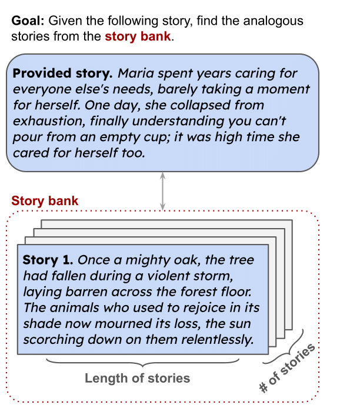

# Analogical Reasoning 

This README explains how to utilize our Python script. The provided script is programmed to perform various tasks related to analogy, using OpenAI's GPT-4. These tasks include sentence or story analogy classification. Follow the instructions given below to use the provided script.

## Introduction

This is the official repo for the paper:

**AnaloBench: Benchmarking the Identification of Abstract and Long-context Analogies**

[[arxiv]](https://arxiv.org/abs/2402.12370) [[Huggingface]](https://huggingface.co/datasets/jhu-clsp/AnaloBench)



The above is an example of our problem setup: given a story, the goal is to identify an analogous story from a story bank. 
We study the difficulty of this goal for LMs by varying the following parameters: 
(i) length of stories, (ii) number of stories in the story bank. 
## Overview

The scripts available in this repository are designed to accomplish different objectives, from dataset generation to model evaluation. These scripts are organized to work together, implementing an end-to-end pipeline.

This repository contains two tasks, T1 and T2. Task T1 requires the model to select the correct option out of four possibilities, whereas Task T2 involves choosing between 5 and 10 correct answers from a list of 200 options.

The tasks are categorized into single-sentence (`S1`) and grouped-sentence tasks (`S10` and `S30`), depending on the number of sentences involved in the task.

## Repository Structure

- `data_generation.py`: Generates datasets for various tasks.
- `t1_evaluation.py`: Analyzes the performance of models on T1 by comparing generated results against ground truth labels.
- `t1.py`: Evaluates models on T1 task across distributed models
- `t2_evaluation.py`: Analyzes the performance of models on T2 by comparing generated results against ground truth labels.
- `t2_GPT4.py`: Evaluates GPT4 on T2 task across distributed models

## Quick Start

### Requirements

- Python 3.x
- PyTorch
- Transformers library from Hugging Face
- Pandas

Additionally, access to Hugging Face models (like llama) might require a Hugging Face account and a personal access token. For GPT4, it requires an OpenAI key.

### Direct Usage Example

```
from datasets import load_dataset
datasets = load_dataset('analo_bench', 'T1S1-Subset')["train"]
```

Here are the configs of the dataset:

| Config       | Task | Sent | Dataset Type      |
|--------------|------|------|-------------------|
| T1S1-Full    | 1    | 1    | Full(24.4k rows)              |
| T1S10-Full   | 1    | 10   | Full(24.4k rows)              |
| T1S30-Full   | 1    | 30   | Full(24.4k rows)              |
| T1S1-Subset  | 1    | 1    | Subset(340 rows)            |
| T1S10-Subset | 1    | 10   | Subset(340 rows)            |
| T1S30-Subset | 1    | 30   | Subset(340 rows)            |
| T2S1         | 2    | 1    | Not Specified     |
| T2S10        | 2    | 10   | Not Specified     |
| T2S30        | 2    | 30   | Not Specified     |

Our dataset Huggingface Link: 

https://huggingface.co/datasets/jhu-clsp/AnaloBench


### Usage

#### Dataset Generation

For T1 and T2 alike, we first create a Base dataset consisting solely of each option's index to ensure uniformity across various situations. Subsequently, we rely on this Base dataset to produce tasks containing 1 sentence, 10 sentences, and 30 sentences.

Generate the base dataset for T1:

```bash
python code/data_generation.py --task generate_t1_base_subset
```

Generate a T1 subset dataset tailored for single sentence classification tasks(Required Base dataset for T1):

```bash
python code/data_generation.py --task generate_t1_s1 --size subset
```


#### Model Evaluation

To evaluate a model with a specific dataset and configuration, use one of the following scripts:

```bash
python code/t1.py --task <TASK_NAME> --model_name <MODEL_NAME> --model_hug <HUGGINGFACE_MODEL> --batch_size <BATCH_SIZE> --modle_loc <LOCATION_OF_THE_MODLE>
```

Replace `<TASK_NAME>`, `<MODEL_NAME>`, `<HUGGINGFACE_MODEL>`, and `<BATCH_SIZE>` with your desired value.

For T1S1 setups:

```bash
python code/t1.py --task S1 --model_name mistral --model_hug mistralai/Mistral-7B-v0.1 --batch_size 4 --modle_loc /data/model
```

#### Evaluation of Results

Run the evaluation script to output accuracy and other relevant metrics:

```bash
python code/t1_evaluation.py
```

### Customization

To use a specific Hugging Face model, you may need to log in with your Hugging Face token:

```python
from huggingface_hub import login
login(token="YOUR_TOKEN")
```

You can uncomment these lines in `t1.py` and replace `"YOUR_TOKEN"` with your actual Hugging Face token.

### Important Notes

- The scripts are set up to read data from a `data`  directory and write data to `result` directory. Ensure these directory exists and has the correct structure and contents as per your dataset requirements.
- The models are loaded from a specified cache directory in the `t1.py` scripts. You may need to update the `cache_dir` variable to match your local setup or use the variable in the command `--modle_loc`
- Owing to the file size restriction imposed by Github, we were unable to upload the entire dataset there. To access the complete datasets, please visit the Huggingface link

## Support

If you encounter any issues or have questions regarding the scripts, please submit an issue in this repository.

## License
This project is available under the MIT License. You can freely modify and use it as per your needs. Please keep in mind OpenAI's terms and policies if you use GPT-4.

## Citation

```
@misc{ye2024analobench,
      title={AnaloBench: Benchmarking the Identification of Abstract and Long-context Analogies}, 
      author={Xiao Ye and Andrew Wang and Jacob Choi and Yining Lu and Shreya Sharma and Lingfeng Shen and Vijay Tiyyala and Nicholas Andrews and Daniel Khashabi},
      year={2024},
      eprint={2402.12370},
      archivePrefix={arXiv},
      primaryClass={cs.CL}
}
```